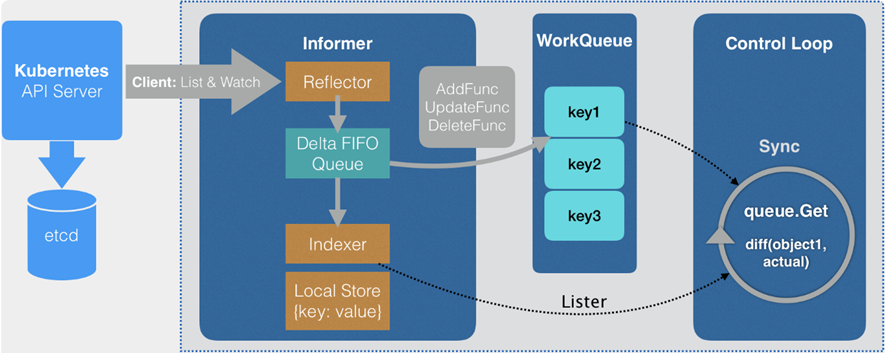

# kubernetes CRD 控制器开发(自动伸缩控制器) 

#### 1. Labels

> labels: [match labels、labels、selector](https://medium.com/@zwhitchcox/matchlabels-labels-and-selectors-explained-in-detail-for-beginners-d421bdd05362)

```yaml
kind: Deployment
metadata:
  name: nginx
  labels:
    app: nginx  # 用来匹配该deployment(nginx)的label
spec:
  selector:
    matchLabels:
      app: nginx # 部署如service等资源时，service通过matchLabels指向这些pod
  template: # deployment下的 pod 模板
    metadata:
      labels: # 该labels描述了deployment需要管理那些pod(用于选择)
        app: nginx
```

在golang中对deployment、pod这些资源对象的访问路径与yaml中相同

#### 2. API Group

k8s中api按照api-group分组：

1. core：/api/v1；yaml: `apiVersion: v1`

2. core之外的资源，路径为：/apis/[GroupName]/[Version]；yaml：`apiVersion: GroupName/Version`

   例如：Deployment：`apiVersion: apps/v1` ；/apis/apps/v1/namespaces/[namespace]/deployments

在golang中，获取资源的路径与上面一致（如deployment：clientset.AppsV1().Deployments(...)...）

#### 3. Web hook

> 深入剖析 Kubernetes MutatingAdmissionWebhook：https://blog.hdls.me/15564491070483.html
>
> 英文原文：https://medium.com/ibm-cloud/diving-into-kubernetes-mutatingadmissionwebhook-6ef3c5695f74

通过 Webhook 自定义资源操作逻辑，不需要重新编译api-server

> webhook-admission-controller实例：https://github.com/caesarxuchao/example-webhook-admission-controller

使用`Mutating Admission Webhook` 可以实现在 webhook中对资源进行修改，通过在 `Mutating Admission Configration` 中配置规则(rules)，来决定对**指定资源**的**指定操作**对应的http请求会被webhook-admission-controller拦截，并在webhook中对资源进行修改。

指定 `AdmissionReviewVersions` 时不能用 `v1` 版本，使用 `v1beta1`，否则 API-server会报错(日志错误)：`failed calling webhook, failing open mpa.k8s.io: failed calling webhook "mpa.k8s.io": expected response`

##### 3.1 webhook更新资源

> 官方说明：https://kubernetes.io/zh/docs/reference/access-authn-authz/extensible-admission-controllers/#response

现在k8s只支持 JsonPatch：` https://jsonpatch.com/`

json结构为：

```json
{
  op: ["Add"|"Remove"|"Copy"],
  Path: "Json Path to operate",
  Value: "New value"
}
```

##### 3.2 配置操作规则

```go
Rules: []admissionregistration.RuleWithOperations{
  // 拦截创建Pod的请求
	{
    Operations: []admissionregistration.OperationType{admissionregistration.Create},
    Rule: admissionregistration.Rule{
      APIGroups:   []string{""},
      APIVersions: []string{"v1"},
      Resources:   []string{"pods"},
    },
  },
  // 其他资源类似
}
```

##### 3.3 tls 证书配置

webhook server与 API-Server通信必须通过 https，所以需要配置tls证书；为了方便，将创建好的证书上传到k8s集群中，容器使用时手动挂载：

```sh
# 详见 ../hack/gencerts.sh
```


##### 3.4 webhook server 部署

部署为k8s中的deployment，在 pod template中指定使用的 tls 证书，并挂载到容器的指定路径中：

```yaml
kind: Deployment
...
spec:
  template:
    spec:
      serviceAccountName: mpa-admission
      containers:
        - name: admission
          volumeMounts:
            - name: tls-certs
              mountPath: "/etc/mpa-tls-certs" # 容器中的挂载路径
              readOnly: true
      volumes:
        - name: tls-certs
          secret:
            secretName: mpa-tls-certs # 已上传到k8s集群的证书 秘钥
```


#### 4. Client-Go



> indexer: [深入浅出indexer](https://blog.csdn.net/weixin_42663840/article/details/81530606?ops_request_misc=%257B%2522request%255Fid%2522%253A%2522161839629716780274184216%2522%252C%2522scm%2522%253A%252220140713.130102334.pc%255Fblog.%2522%257D&request_id=161839629716780274184216&biz_id=0&utm_medium=distribute.pc_search_result.none-task-blog-2~blog~first_rank_v2~rank_v29-1-81530606.nonecase&utm_term=%E6%B7%B1%E5%85%A5%E6%B5%85%E5%87%BAkubernetes%E4%B9%8Bclient-go)
>
> SharedInformer: [深入浅出SharedInformer](https://blog.csdn.net/weixin_42663840/article/details/81699303?ops_request_misc=%257B%2522request%255Fid%2522%253A%2522161839629716780274184216%2522%252C%2522scm%2522%253A%252220140713.130102334.pc%255Fblog.%2522%257D&request_id=161839629716780274184216&biz_id=0&utm_medium=distribute.pc_search_result.none-task-blog-2~blog~first_rank_v2~rank_v29-4-81699303.nonecase&utm_term=%E6%B7%B1%E5%85%A5%E6%B5%85%E5%87%BAkubernetes%E4%B9%8Bclient-go)
>
> SharedInformerFactory: [深入浅出SharedInformerFactory](https://blog.csdn.net/weixin_42663840/article/details/81980022?ops_request_misc=%257B%2522request%255Fid%2522%253A%2522161839629716780274184216%2522%252C%2522scm%2522%253A%252220140713.130102334.pc%255Fblog.%2522%257D&request_id=161839629716780274184216&biz_id=0&utm_medium=distribute.pc_search_result.none-task-blog-2~blog~first_rank_v2~rank_v29-2-81980022.nonecase&utm_term=%E6%B7%B1%E5%85%A5%E6%B5%85%E5%87%BAkubernetes%E4%B9%8Bclient-go)
>
> Workqueue: [深入浅出workqueue](https://blog.csdn.net/weixin_42663840/article/details/81482553?ops_request_misc=%257B%2522request%255Fid%2522%253A%2522161839629716780274184216%2522%252C%2522scm%2522%253A%252220140713.130102334.pc%255Fblog.%2522%257D&request_id=161839629716780274184216&biz_id=0&utm_medium=distribute.pc_search_result.none-task-blog-2~blog~first_rank_v2~rank_v29-3-81482553.nonecase&utm_term=%E6%B7%B1%E5%85%A5%E6%B5%85%E5%87%BAkubernetes%E4%B9%8Bclient-go)
>
> DeltaFIFO: [deltafifo](https://blog.csdn.net/weixin_42663840/article/details/81626789?ops_request_misc=%257B%2522request%255Fid%2522%253A%2522161839629716780274184216%2522%252C%2522scm%2522%253A%252220140713.130102334.pc%255Fblog.%2522%257D&request_id=161839629716780274184216&biz_id=0&utm_medium=distribute.pc_search_result.none-task-blog-2~blog~first_rank_v2~rank_v29-5-81626789.nonecase&utm_term=%E6%B7%B1%E5%85%A5%E6%B5%85%E5%87%BAkubernetes%E4%B9%8Bclient-go)
>
> client-go解析：https://www.cnblogs.com/charlieroro/p/10330390.html

REST Mapper(local store中的资源mapper)获取：

```go
discoveryClient := discovery.NewDiscoveryClientForConfigOrDie(config)
cachedDiscoveryClient := cachedDiscovery.NewMemCacheClient(discoveryClient)
restMapper := restmapper.NewDeferredDiscoveryRESTMapper(cachedDiscoveryClient)

go wait.Until(func() {
  restMapper.Reset()
}, 1 * time.Minite(), make(chan struct{}))
```

获取支持scale的资源(如deployment管理下的replicaset)：

```go
// 获取target的 group Version
targetGroupVersion, err := schema.ParseGroupVersion(APIVersion)
// 构造 Group + Kind
targetGroupKind := schema.GroupKind{
		Group: targetGroupVersion.Group,
		Kind:  mpa.Spec.TargetRef.Kind,
}
// 通过 restMapper 获取所有匹配的资源
mappings, err := u.mapper.RESTMappings(targetGroupKind)
// 遍历 mappings 对每个 mapping 的 GroupResource
// 使用 ScaleGetter 进行处理, 需要对 scaleObj 更新时，使用 Update接口
scaleObj, err =
			u.scaleNamespacer.Scales(Namespace).Get(context.TODO(), mapping.Reousrce.GroupResource, targetName, metav1.GetOptions{})
```


#### 5. RBAC鉴权

> k8s: https://kubernetes.io/docs/reference/access-authn-authz/authorization/
>
> https://kubernetes.io/docs/reference/access-authn-authz/rbac/
>
> 文章：https://zhuanlan.zhihu.com/p/121090458

- Role：在指定 namespace 中进行权限认证(创建role时需要指定所属namespace)

- ClusterRole：非 namespace 资源，集群范围的控制

MPA中使用ClusterRole进行访问控制：

1. 定义需要访问下面规则定义中的资源的 serviceAccount
2. 定义ClusterRole 声明资源的访问规则
3. 定义 ClusterRoleBinding，将 ClusterRole中定义的访问权限授予指定的 **(user/group/serviceAccount)**

*`system:`前缀表示：代表其中绑定的资源是作为基础设施适用和占有的*

##### 定义 ClusterRole

使用 `kubectl api-resources -o wide` 查看api资源的信息(API Group +  name + verbs)

`configmap` 中存储了 Pod 的配置数据

##### ServiceAccount

> service Account for pods: https://kubernetes.io/docs/tasks/configure-pod-container/configure-service-account/
>
> manage service Account: https://kubernetes.io/docs/reference/access-authn-authz/service-accounts-admin/

#### 6. 其他

##### 6.1. Limit Ranges

> k8s: https://kubernetes.io/docs/concepts/policy/limit-range/

namespace中的资源分配的约束策略(to pods and containers)

##### 6.2. pod 驱逐策略

被deployment管理的pod，被驱逐后，该deployment下的副本控制器会自动创建新的pod来由k8s调度

> 驱逐策略：https://kubernetes.io/zh/docs/concepts/scheduling-eviction/eviction-policy/
>
> 驱逐宽限期：https://kubernetes.io/zh/docs/tasks/administer-cluster/out-of-resource/

## Prometheus

#### client-golang

collector(histogram, guage, summary, counter) 使用前必须注册，使用步骤：

```go
// 1. 定义 collector
httpRequestsTotal = prometheus.NewCounter(
		prometheus.CounterOpts{
			Name: "http_requests_total",
			Help: "统计该应用的http请求数",
		},
	)
// 2. 注册collector
registry := prometheus.NewRegistry()
registry.MustRegister(httpRequestsTotal)
// 3. 对外暴露获取metrics的接口
http.Handle("/metrics", promhttp.HandlerFor(registry, promhttp.HandlerOpts{}))
err := http.ListenAndServe(address, nil)
```


#### 安装 prometheus

> 官方：https://github.com/prometheus-operator/kube-prometheus#Quickstart
>
> 步骤：https://www.qikqiak.com/k8s-book/docs/58.Prometheus%20Operator.html

```bash
# 修改prometheus-k8s和grafana的服务类型为 NodePort
# 修改containers的imagePullPolicy为 IfNotPresent
kubectl create -f manifests/setup
kubectl create -f manifests/
```

#### 安装 prometheus-adapter & custom-metrics-api

与prometheus安装在同一个namespace

> 官方：https://github.com/kubernetes-sigs/prometheus-adapter/tree/master/deploy
>
> 安装步骤：https://blog.csdn.net/qq_21816375/article/details/82662897
>
> https://www.cnblogs.com/dudu/p/12146344.html
>
> cm-certs证书错误：https://www.cnblogs.com/centos-python/articles/10921991.html

```bash
# 1. 安装 golang
# 2. 安装 yum groupinstall "Development Tools" "Development Libraries"
# 3. 生成 证书 + 秘钥
# cm-adapter-serving-certs.yaml 中必须指定namespace与下面的deployment相同
kubectl create -f cm-adapter-serving-certs.yaml
# 修改 deployment 中的 imagePullPolicy
# 修改 - --prometheus-url=http://[ServiceName].[namespace].[svc]:9090
kubectl create -f deploy/manifests/
# 查看api
kubectl api-versions
kubectl get --raw "/apis/custom.metrics.k8s.io/v1beta1"
kubectl get --raw "/apis/custom.metrics.k8s.io/v1beta1/namespaces/kube-system/pods/*/memory_usage_bytes"
```

测试：

> 测试参考：https://github.com/kubernetes-sigs/prometheus-adapter/blob/master/docs/walkthrough.md

```yaml
apiVersion: apps/v1
kind: Deployment
metadata:
  name: sample-app
  labels:
    app: sample-app
spec:
  replicas: 1
  selector:
    matchLabels:
      app: sample-app
  template:
    metadata:
      labels:
        app: sample-app
    spec:
      containers:
      - image: luxas/autoscale-demo:v0.1.2
        name: metrics-provider
        ports:
        - name: http
          containerPort: 8080
---
apiVersion: v1
kind: Service
metadata:
  labels:
    app: sample-app
  name: sample-app
spec:
  ports:
  - name: http
    port: 80
    protocol: TCP
    targetPort: 8080
  selector:
    app: sample-app
  type: ClusterIP
---
# monitor 指向应用，来获取该应用的自定义metrics
kind: ServiceMonitor
apiVersion: monitoring.coreos.com/v1
metadata:
  name: sample-app
  labels:
    app: sample-app
spec:
  selector:
    matchLabels:
      app: sample-app
  endpoints:
  - port: http
```

```bash
curl http://$(kubectl get service sample-app -o jsonpath='{ .spec.clusterIP }')/metrics
kubectl get --raw "/apis/custom.metrics.k8s.io/v1beta1/namespaces/default/pods/*/http_requests?selector=app%3Dsample-app"
# metrics
pods/http_requests : 每两秒计算一次 - 每秒的请求数量
# 度量单位
- 500m : 每秒 0.5 个请求
- 10 : 每秒 10 个请求
- 10500m : 每秒 10.5 个请求
for i in `seq 1 200`; do curl http://$(kubectl get service sample-app -o jsonpath='{ .spec.clusterIP }')/metrics ; done
```


> 通过custom-metrics-api获取QPS
>
> 自定义metrics: https://github.com/kubernetes-sigs/prometheus-adapter/blob/master/docs/config-walkthrough.md
>
> python自定义：https://www.cnblogs.com/rexcheny/p/10740536.html
>
> **详细流程**：https://learnk8s.io/autoscaling-apps-kubernetes
>
> https://github.com/kubernetes-sigs/custom-metrics-apiserver/blob/master/docs/getting-started.md
>
> 参考：https://www.cnblogs.com/charlieroro/p/11898521.html
>
> https://github.com/kubernetes/community/blob/master/contributors/design-proposals/instrumentation/custom-metrics-api.md
>
> https://kubernetes.io/docs/tasks/run-application/horizontal-pod-autoscale/#support-for-metrics-apis
>
> https://www.cnblogs.com/dudu/p/12217354.html
>
> https://segmentfault.com/a/1190000017875621
>
> https://www.cnblogs.com/dudu/p/12146344.html

## 环境相关

### 1. Docker 镜像代理问题

1. 使用阿里云的镜像构建仓库：https://cr.console.aliyun.com/cn-shanghai/instance/dashboard，配置读取github仓库的image Dockerfile，并构建，在本机通过自己的阿里云registry拉去镜像

   docker需要登录自己的阿里云registry账户，才能 push、pull

2. 使用 Docker 官方的提供的私人 registry，https://hub.docker.com/u/aliverjon，本地已经构建好的镜像可以push到个人的仓库中，(镜像名必须以自己的用户名打头)，登录push之后，下次pull不需要登录docker hub账户

在kubernetes集群中部署容器实例时，每个worker node上都要能pull到指定的镜像。
